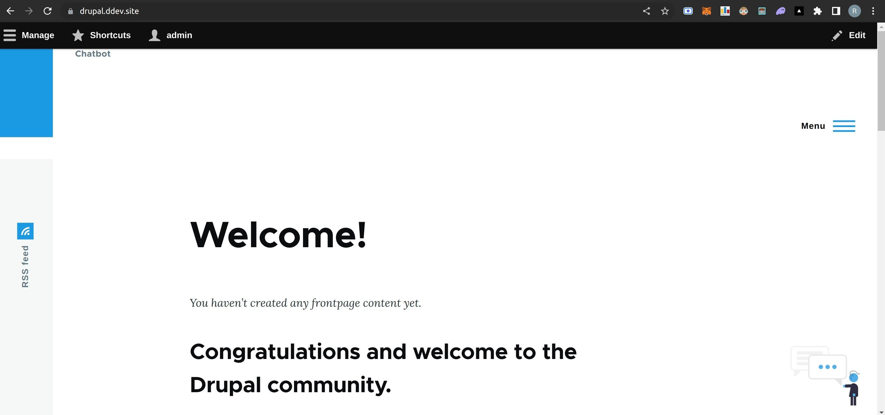
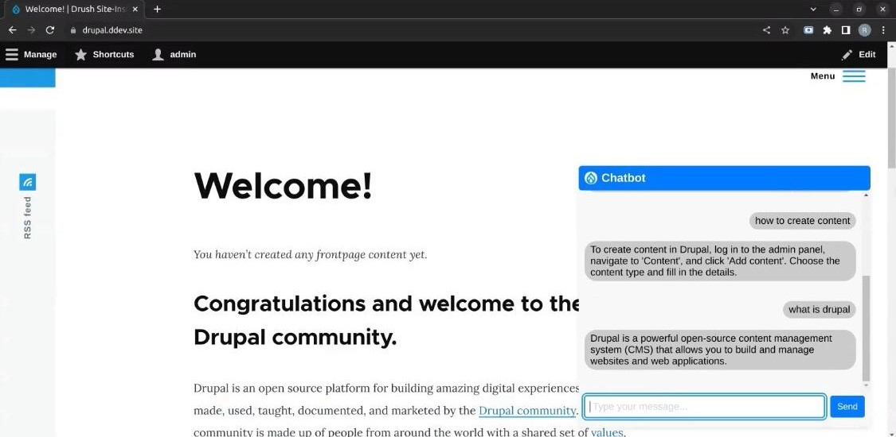

# Chatbot Interface for Drupal Documentation and Contributor Onboarding

## Project Description

Through Google Summer of Code, I revitalized the Drupal Chatbot Module. I developed a chatbot from scratch, designed a versatile Drupal block for seamless integration, optimized UI across devices, and harnessed local data storage. This journey honed my skills, emphasized adaptability, and highlighted the value of open-source collaboration.

## High Level Design

## Features

- **Custom Module Creation**: Developed a tailored Drupal module from scratch, forming the foundation for advanced chatbot functionality.
- **Intelligent Chatbot Logic**: Engineered a sophisticated chatbot logic capable of understanding and responding intelligently to user queries.
- **User-Centric UI/UX Design**: Designed an intuitive interface prioritizing seamless user experiences for effective interactions.
- **Versatile Drupal Block**: Created a flexible Drupal block, facilitating easy customization and placement within various webpage regions.
- **Local Data Storage Integration**: Incorporated local data storage for efficient user preference retention and seamless chat history access.

## Challenges and Learning

- **Problem-Solving Proficiency**: Overcame technical challenges like CSS conflicts and resource integration, honing adept problem-solving skills.
- **Drupal Ecosystem Mastery**: Navigated Drupal's architecture, APIs, and modules, gaining deep insights into the platform's intricacies.
- **User-Centric Design**: Prioritized seamless UI/UX, learning to value user-centered design principles for functional, enjoyable software.
- **Effective Collaboration**: Engaged in mentorship and collaboration, grasping the importance of teamwork, communication, and feedback.
- **Time Management Skills**: Balanced project tasks, milestones, and iterative development, refining time management and adaptability.

## Suggested Improvements

- **Advanced Feature Integration**: Exploring more advanced integrations or features, such as third-party APIs or additional modules, could enhance the module's capabilities and user experience.
- **Enhanced Documentation**: Creating comprehensive documentation for the module's installation, configuration, and usage would aid both users and future contributors in understanding and extending the module.
- **Code Refactoring and Best Practices**: Continuously refactoring code and adhering to coding standards and best practices can enhance the module's maintainability and readability.
- **Security Auditing**: Conducting thorough security audits and implementing best practices for securing the module can contribute to a safer experience for users.
- **Localization and Internationalization**: Adding support for localization and internationalization could make the module accessible to users from various linguistic and cultural backgrounds.

## Experience

My Journey at Google Summer of Code with Drupal: \
[Week 1-2](https://medium.com/@royalpinto007/week-1-2-my-journey-at-google-summer-of-code-with-drupal-9013880d8b8b) \
[Week 3-4](https://medium.com/@royalpinto007/week-3-4-my-journey-at-google-summer-of-code-with-drupal-69eaf22a5499) \
[Week 5-6](https://medium.com/@royalpinto007/week-5-6-my-journey-at-google-summer-of-code-with-drupal-f97819cd589d) \
[Week 7-8](https://medium.com/@royalpinto007/week-7-8-my-journey-at-google-summer-of-code-with-drupal-ca84364c6316) \
[Week 9-10](https://medium.com/@royalpinto007/week-9-10-my-journey-at-google-summer-of-code-with-drupal-85137f7b7dc9)

## Preview

<!--  -->

## Details

Organisation- [Drupal Association](https://www.drupal.org/) \
Profile- [Royal Simpson Pinto](https://www.drupal.org/u/royalpinto007) \
Project Reference- [Google Summer of Code](https://summerofcode.withgoogle.com/programs/2023/projects/V6n2jJa5)

## License

This project is licensed under the MIT License. See the [LICENSE](LICENSE) file for details.
