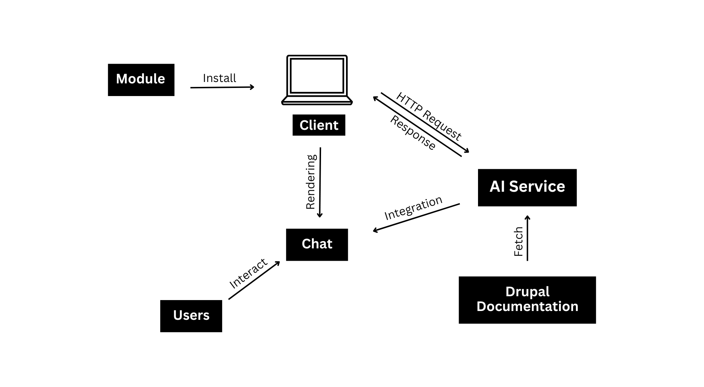

# Chatbot Interface for Drupal Documentation and Contributor Onboarding

[Under Development]
## Project Description

This project aims to develop a chatbot interface for Drupal documentation and contributor onboarding, enhancing accessibility and simplifying the learning curve for new contributors. By leveraging different techniques, the chatbot will provide interactive guidance and support, improving user experience and fostering innovation within the Drupal community.

## High Level Design 

## Experience
My Journey at Google Summer of Code with Drupal: \
[Week 1-2](https://medium.com/@royalpinto007/week-1-2-my-journey-at-google-summer-of-code-with-drupal-9013880d8b8b) 

## Details

Organisation- [Drupal Association](https://www.drupal.org/) \
Profile- [Royal Simpson Pinto](https://www.drupal.org/u/royalpinto007) \
Project Reference- [Google Summer of Code](https://summerofcode.withgoogle.com/programs/2023/projects/V6n2jJa5) 

## License

This project is licensed under the MIT License. See the [LICENSE](LICENSE) file for details.
